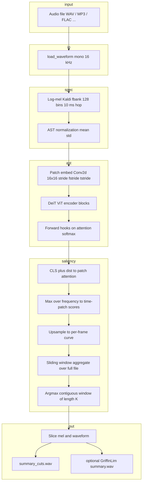

# AST speech summarization — implementation and pipeline

This document describes **how the project is structured**, **how data flows** from input audio to summary outputs, and **what each file does**. It is intended for developers and technical clients.

---

## 1. High-level idea

The system does **not** use AST’s classification logits for “what was said.” Instead it uses **self-attention** inside the pretrained **Audio Spectrogram Transformer (AST)** as a **saliency signal**: time regions that the model attends to strongly are treated as more important.

From a **full-length** log-mel spectrogram (or the first window in legacy mode), the code:

1. Builds a **per-frame importance** curve (after sliding AST over long audio).
2. Selects **one contiguous** segment of mel frames whose **total** importance is maximal (default **60 seconds** at 10 ms per frame → **6000 frames**).
3. Exports:
   - **`--out-wav-cuts`**: the corresponding slice of the **original waveform** (recommended for listening).
   - **`--out-wav`**: optional **Griffin–Lim** reconstruction from the summary mel (often silent or low quality for long clips; see §8).

This is **speed / saliency summarization**, not semantic summarization (no ASR or NLP of “main ideas”).

---

## 2. Repository layout

| Path | Role |
|------|------|
| `README.md` | Quick install and CLI for end users |
| `requirements.txt` | Python dependencies |
| `ast/` | Upstream **AST** code: ViT backbone, `ASTModel` definition |
| `ast/src/models/ast_models.py` | **ASTModel**: patch embed, DeiT blocks, classification head |
| `ast/pretrained_models/` | Cached weights (timm DeiT ImageNet; optional AudioSet `.pth`) |
| `ast_summarize/` | This application: I/O, mel, attention, selection, CLI |
| `examples/audio/` | Place input files (e.g. `your.mp3`) |
| `examples/output/` | Write `summary.wav`, `summary_cuts.wav`, etc. |

---

## 3. End-to-end pipeline (conceptual)



---

## 4. Module-by-module implementation

### 4.1 `ast_summarize/mel_ast.py`

| Piece | Implementation |
|--------|------------------|
| **Load audio** | `load_waveform()`: resolves path; **WAV/FLAC** via **soundfile**; **MP3/M4A/…** via **ffmpeg** (stdout `f32le` mono at 16 kHz). Raises `FileNotFoundError` with folder listing if path is wrong. |
| **Mel (fixed length)** | `waveform_to_mel_fbank()`: `torchaudio.compliance.kaldi.fbank` (HTK-compatible, Hanning, 128 mels, 10 ms shift), pad/crop to `target_length`, then `(x - mean) / (std * 2)` using AudioSet-style stats. |
| **Mel (full file)** | `waveform_to_mel_fbank_full()`: same fbank + norm, no truncation (used for timed summarization). |
| **Batch shape** | `prepare_batch()`: `[T, F]` → `[1, T, F]` for `ASTModel`. |
| **Denorm** | `denormalize_mel()`: inverse of AST normalization for vocoder experiments. |
| **Save** | `save_waveform()`: **soundfile** WAV PCM16; fallback `torchaudio.save`. |

Constants: `SAMPLE_RATE=16000`, `NUM_MELS=128`, `AUDIOMEAN`, `AUDIOSTD` (match `ast` dataloader recipe).

---

### 4.2 `ast/src/models/ast_models.py` (upstream, lightly patched)

| Piece | Implementation |
|--------|------------------|
| **Backbone** | timm **DeiT** distilled ViT (`base384` by default). |
| **Patch embedding** | `Conv2d(1, D, kernel=(16,16), stride=(fstride,tstride))` on `[B,1,F,T]` (frequency × time). |
| **Tokens** | CLS + distillation + patch tokens; positional embeddings resized to `(f_dim, t_dim)` grid. |
| **Forward** | Patch embed → add pos → transformer blocks → norm → average CLS+dist → `mlp_head` → logits (527 classes for AudioSet head). |
| **timm version** | Hard assert relaxed to a **warning** so newer timm can be tried; attention hooks assume classic `attn_drop` layout (timm 0.4.5 is the reference). |

The summarization code calls **full forward** to run hooks; logits are not used for ranking.

---

### 4.3 `ast_summarize/attention_extract.py`

| Function | Role |
|----------|------|
| `_patch_grid_dims()` | Reads stride from `model.v.patch_embed.proj` and `model.get_shape(...)` for `f_dim × t_dim` patch grid. |
| `collect_attention_matrices()` | Registers **forward hooks** on **`attn_drop`** inputs for the last `num_last_blocks` blocks (default 6). Those inputs are the **softmax attention** tensor. Stacks captures → `[L, B, H, N, N]`. |
| `attention_to_time_patch_importance()` | Averages over layers; from each head, takes attention from **token 0 (CLS)** and **token 1 (dist)** to **patch** columns; averages heads; reshapes to `[B, f_dim, t_dim]`; **max over frequency** → `[B, t_dim]` time-patch importance. |
| `frame_importance_from_patches()` | For each mel frame index, assigns the **max** importance among patches that cover that frame (patch length 16 along time, stride `tstride`). |

---

### 4.4 `ast_summarize/pipeline.py`

| Function / type | Role |
|-----------------|------|
| `_best_contiguous_frame_indices()` | Given per-frame scores and length `k`, finds **one** interval `[start, start+k)` with **maximum sum** of scores (`unfold` + `argmax`). Guarantees a **single listenable** excerpt (no scattered 10 ms hops). |
| `load_ast_model()` | Prepends `ast/src` to `sys.path`, sets `TORCH_HOME` to `ast/pretrained_models`, **chdirs** to `ast/src` during import (so relative pretrained paths in upstream code resolve), builds `ASTModel`, moves to CPU/CUDA, `eval()`. |
| `_ast_speed_summarize_timed()` | **Timed mode** (`summary_duration_sec > 0`): full mel → loop over **non-overlapping** chunks of length `target_length` (default 1024) → each chunk through AST + attention → **sum and count** overlapping frame scores into a global vector → normalize → `k = min(round(sec*100), T_full)` → `_best_contiguous_frame_indices` → slice mel and build outputs. |
| `ast_speed_summarize()` | If `summary_duration_sec > 0`, delegates to `_ast_speed_summarize_timed`. Else **legacy**: first `target_length` mel frames only, single AST forward, `keep_ratio` → number of frames `k`, same **contiguous** best window inside that segment. |
| `ASTSummarizeResult` | Holds `mel_full`, `mel_summary`, `waveform_summary`, `selected_frame_indices`, `time_patch_importance`, `f_dim`, `t_dim`. |
| `waveform_cuts_from_frames()` | Maps frame indices to sample ranges (`hop = sr * 0.01`). If indices form **one contiguous run**, **one slice** `wav[:, start:end]` (no per-hop stitching). |
| `_write_flow_verification()` | Optional debug: `.npy` dumps + `FLOW_IMPLEMENTATION_MAP.txt` when `debug_dir` is set. |

---

### 4.5 `ast_summarize/vocoder.py`

| Function | Role |
|----------|------|
| `log_mel_to_waveform_approx()` | Denormalized log-mel → `exp` → `InverseMelScale` (HTK/slaney) → **Griffin–Lim**. For **>2500** frames, returns **zeros** of approximate length (Griffin–Lim would be too slow / fragile). |

---

### 4.6 `ast_summarize/run_ast_summarize.py`

CLI entry: parses `--audio`, `--out-wav`, `--out-wav-cuts`, `--summary-duration-sec` (default **60**), `--summary-duration-sec 0` for legacy window, `--keep-ratio`, `--target-length`, `--last-blocks`, `--device`, `--audioset-pretrain`, `--debug-dir`. Resolves repo root as **parent of `ast_summarize/`**, calls `ast_speed_summarize`, saves waves, prints excerpt time range and notes about Griffin–Lim.

---

### 4.7 `ast_summarize/chunk_audio.py`

Utilities to **concatenate** many `.flac`/`.wav` (sorted by numeric suffix): each file loaded via **`load_waveform`** (so MP3 works if ffmpeg exists), optional short silence, output WAV via soundfile.

---

## 5. Two operating modes (summary length)

### 5.1 Timed mode (default): `--summary-duration-sec 60` (or any positive value)

1. Full mel: `T_full` frames (~`duration * 100` if shorter than cap).
2. AST window size `W = target_length` (default **1024** ≈ 10.24 s of mel per forward).
3. For `start = 0, W, 2W, …`: pad last chunk, forward, accumulate `global_scores[frame] += local_score`, `global_counts[frame] += 1`.
4. `agg = global_scores / global_counts`.
5. `k = min(round(seconds * 100), T_full)`.
6. Best contiguous window of length `k` on `agg`.
7. Output: that window in **original time order** in the waveform.

### 5.2 Legacy mode: `--summary-duration-sec 0`

1. Mel only first `target_length` frames (rest of file ignored for AST).
2. Single AST forward.
3. `k = round(keep_ratio * T)`.
4. Best contiguous window of length `k` inside that segment.

---

## 6. External dependencies and runtime behavior

| Dependency | Use |
|------------|-----|
| **PyTorch** | Model and tensors |
| **torchaudio** | Kaldi fbank, resampling, optional transforms |
| **timm 0.4.5** (recommended) | DeiT ViT inside AST |
| **soundfile** | WAV/FLAC I/O without TorchCodec |
| **ffmpeg** (PATH) | MP3/M4A decode |
| **numpy** | Debug saves, ffmpeg buffer |
| **wget** | Optional AudioSet weight download in upstream `ast_models` |

First run may download **DeiT** weights into `ast/pretrained_models/hub/` (via `TORCH_HOME`).

---

## 7. Outputs explained

| Output | Meaning |
|--------|---------|
| **`summary_cuts.wav`** | **Original** audio samples for the chosen mel frame range (contiguous). **Use this for demos.** |
| **`summary.wav` (Griffin–Lim)** | Re-synthesized from summary mel; often **silent or poor** for long summaries (>2500 frames) by design. |

---

## 8. Limitations (important for reports)

1. **Saliency ≠ semantics**: High attention does not mean “main topic”; it is a heuristic from a model trained for **tagging**, not summarization.
2. **Single contiguous clip**: The “summary” is one time interval, not multiple highlights.
3. **AST input is mel**: Pipeline matches **AST training** normalization; vocoder mismatch means Griffin–Lim is experimental.
4. **Long audio cost**: Timed mode runs **one full forward per** `target_length` chunk (~15 forwards per ~2.5 minutes of mel at `W=1024`).

---

## 9. Quick reference: call graph

```
run_ast_summarize.main()
  └── ast_speed_summarize()
        ├── [timed] _ast_speed_summarize_timed()
        │     ├── load_waveform              (mel_ast)
        │     ├── waveform_to_mel_fbank_full (mel_ast)
        │     ├── load_ast_model             (pipeline → ASTModel)
        │     └── loop: collect_attention_matrices → attention_to_time_patch_importance
        │              → frame_importance_from_patches
        │     ├── _best_contiguous_frame_indices
        │     ├── mel slice, log_mel_to_waveform_approx (vocoder)
        │     └── optional _write_flow_verification
        └── [legacy] same but waveform_to_mel_fbank (truncated) + single pass

CLI also calls waveform_cuts_from_frames() for --out-wav-cuts
```

---

## 10. Related reading

- Upstream AST paper and repo: see `ast/README.md` and citation inside it.
- Client quick start: project root `README.md`.

---

*Document version: matches codebase layout as of the `ast_summarize` package with timed contiguous summarization and ffmpeg-based MP3 loading.*
